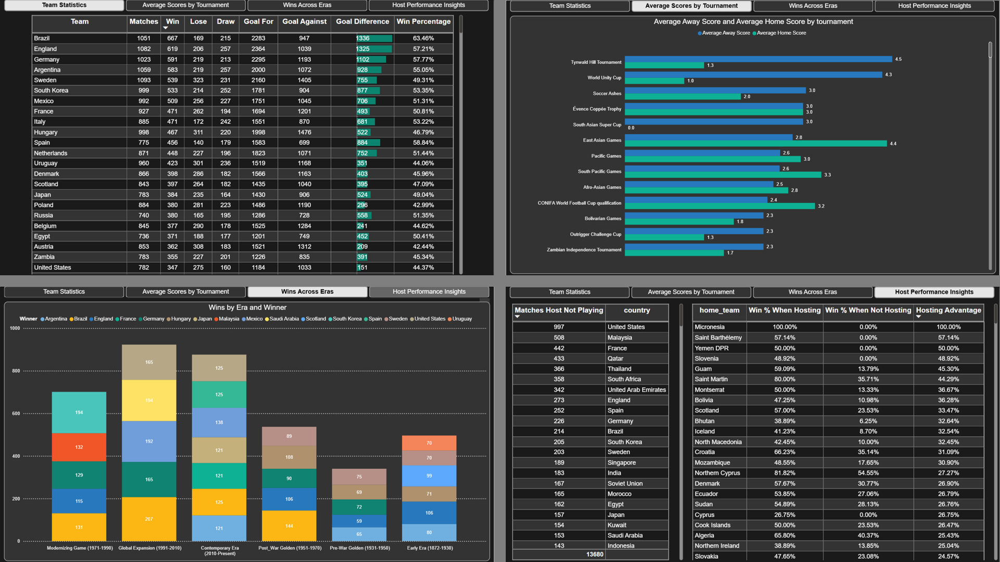
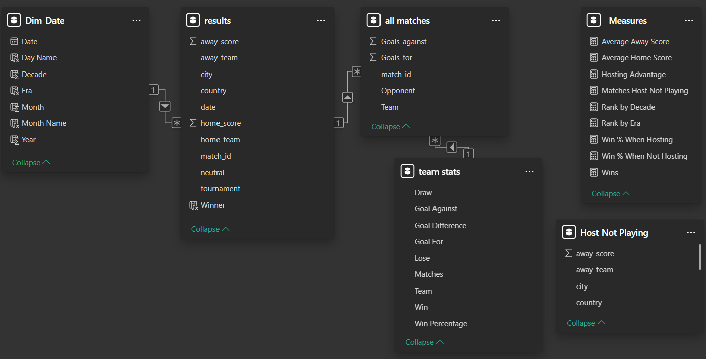
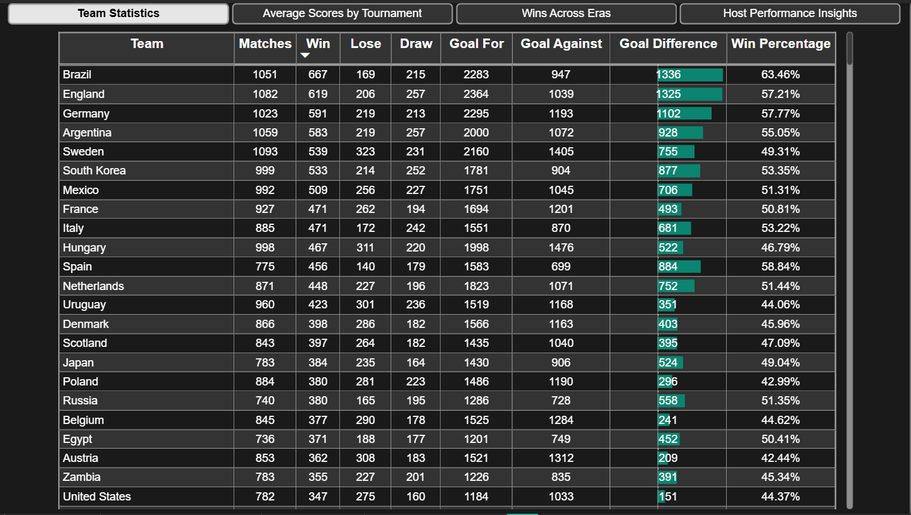
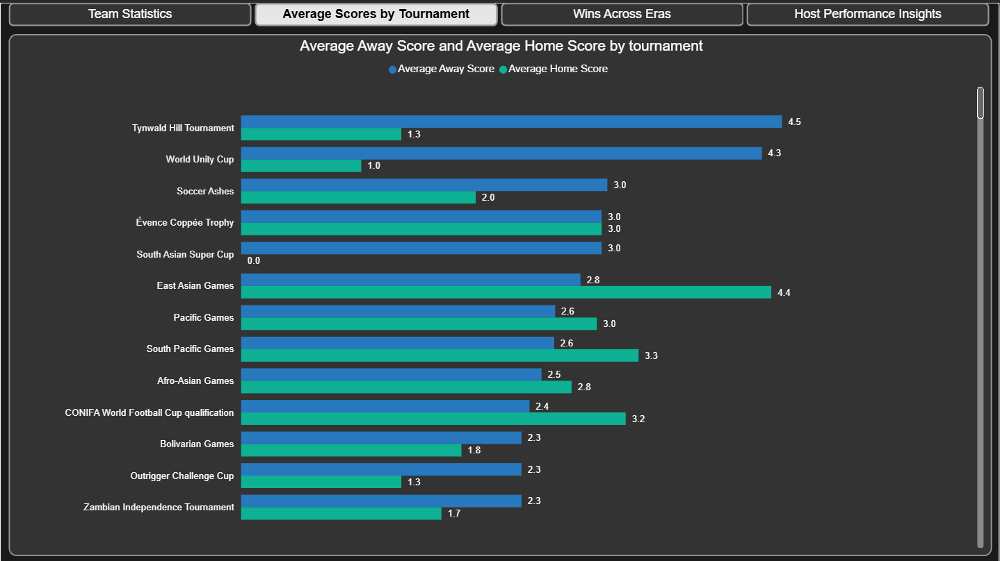
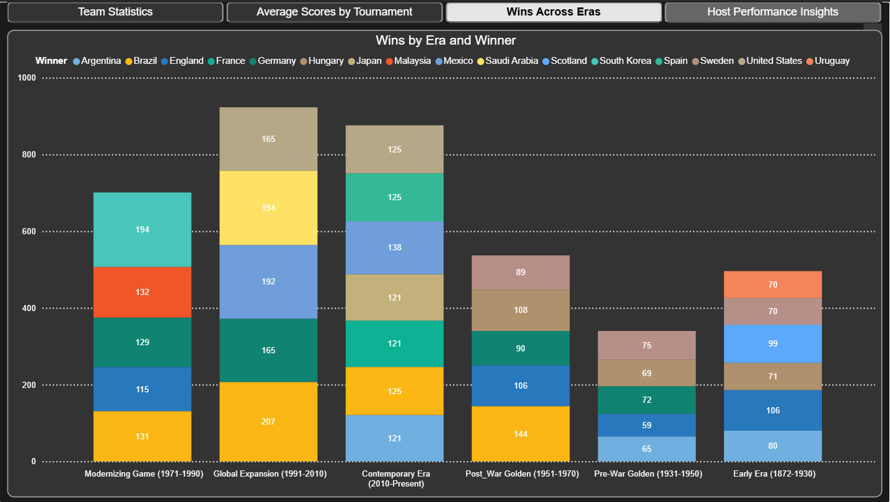
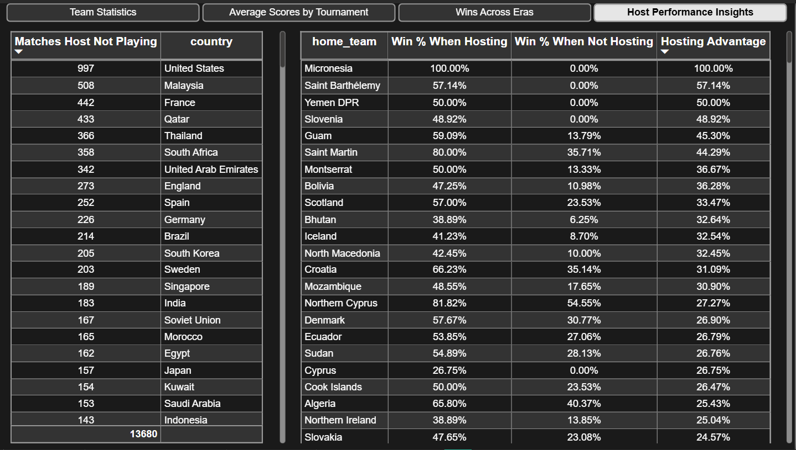

# International Football Matches Analysis (1872–2025)

## Table of Contents
- [Introduction](#Introduction)
- [Problem Statement](#Problem-Statement)
- [Project Overview](#Project-Overview)
- [Dataset](#Dataset)
- [Data Cleaning and Preparation](#Data-Cleaning-and-Preparation)
- [Data Model](#Data-Model)
- [Report Overview](#Report-Overview)
- [Results](#Results)
- [Tools and Technologies](#Tools-and-Technologies)
- [File Structure](#File-Structure)
- [Getting Started](#Getting-Started)


## Introduction

This project analyzes international men’s football results from 1872 to 2025 using PostgreSQL for data transformation and Power BI Desktop for interactive reporting. It explores historical trends, team dominance, tournament patterns, and whether hosting confers a measurable advantage.




## Problem Statement

International football data spans centuries, formats, and competitions, making it challenging to answer questions like:
- Which teams have been consistently dominant across eras?
- How do scoring patterns differ by tournament and venue?
- Which countries host the most neutral matches?
- Does hosting major tournaments meaningfully increase win rates?

This project cleans, models, and visualizes the data to deliver precise, evidence-backed answers.


## Project Overview

- **Data Import:** Loaded results.csv into PostgreSQL.
- **Transformation:** Built reusable CTE to unify home/away rows, compute team metrics, derive era-based dominance, and quantify hosting effects.
- **Modeling:** Designed a Power BI star schema centered on match results with supporting dimensions and measures.
- **Reporting:** Built a 4-page report in Power BI Desktop.


## Dataset

- **File:** results.csv
- **Source:** [International Football Results (Kaggle)](https://www.kaggle.com/datasets/martj42/international-football-results-from-1872-to-2017)
- **Core fields:** date, home_team, away_team, home_score, away_score, city, country, tournament, neutral


## Data Cleaning and Preparation

- **Date normalization:** Ensured proper date types for time intelligence (Year, Month, Decade, Era).
- **Home/Away Normalization:**
  - Built CTEs for home and away perspectives.
  - Stacked into a single long-format table (`all_matches`) with per-team rows, goals for/against, and W/L/D flags.
- **Aggregations:** Computed `team_stats` for Matches, Win, Draw, Lose, Goals For/Against, Goal Difference, Win Percentage.
- **Major Tournaments View:** Filtered teams with appearances in FIFA World Cup, UEFA Euro, Copa América, and Olympics.
- **Era Segmentation:** Derived eras/decades and applied ranking to find the top team per decade (minimum activity threshold).
- **Hosting Features:** Identified neutral-venue hosting and built host-vs-non-host win rate comparisons for major tournaments.


## Data Model

- **Tables:**
  - **Dim_Date:** Date, Year, Decade, Era, Month, Month Name.
  - **results:** match_id, date, home_team, away_team, home_score, away_score, city, country, tournament, neutral, winner.
  - **all matches:** match_id, team, opponent, goals_for, goals_against, city, date.
  - **team stats:** Team, Matches, Win, Draw, Lose, Goals For, Goals Against, Goal Difference, Win Percentage.
  - **Host Not Playing** (hosted matches where the host is not a participant).
  - **_Measures:** Average Home Score, Average Away Score, Hosting Advantage, Rank by Decade and more.
- **Relationships:**
  - Dim_Date[Date] → results[date] (one-to-many)
  - results[match_id] → all matches[match_id] (one-to-many)
  - all matches[team] → team stats[Team] (many-to-one)
  
  

- **Design notes:** Measures table is intentionally unlinked (calc container). Star-like layout ensures fast filtering by date, team, and tournament.


## Report Overview

### Page 1 — Team Statistics



Before diving into trends and comparisons, the report begins by grounding the viewer in the raw competitive record of each nation:
- A comprehensive leaderboard lists matches played, wins losses, draws, goals scored and conceded, goal difference, and win percentage for every team.
- This foundation makes it easy to identify historically high‑performing teams, assess their overall efficiency through win percentage and goal difference, and compare nations’ all‑time records side‑by‑side.

### Page 2 — Average Scores by Tournament



The analysis then shifts from overall records to the nuances of match context, exploring how venue influences scoring:
- Side‑by‑side bars compare average goals scored by home teams versus away teams across a variety of tournaments.
- The visual story reveals where home advantage is most pronounced, where the playing field is more balanced, and how competition type can shape scoring patterns.

### Page 3 — Wins Across Eras



The third page steps back to view the sweep of football history, charting how dominance has shifted across six distinct eras:
- A stacked bar chart breaks down total wins by country within each era, from the Early Era through the Contemporary period. The visual reveals the early supremacy of European nations, the post‑war emergence of Brazil, Germany, and Hungary, and the gradual broadening of the competitive landscape.
- As the decades progress, the narrative shifts from a handful of dominant powers to a more diverse cast — with Argentina, Uruguay, Japan, South Korea, and others rising to prominence — illustrating football’s transformation into a truly global contest.

### Page 4 — Host Performance Insights



The final page turns the spotlight on the influence of home turf, quantifying how much hosting can tilt the odds in a team’s favour:
- A detailed table contrasts each nation’s win percentage when hosting against their win rate when playing elsewhere, calculating a clear Hosting Advantage metric.
- Alongside, it records the number of matches each country has hosted without participating — a measure of their role as a neutral‑venue hub in the global game.
- The data reveals striking patterns: some nations enjoy a dramatic boost in performance when playing at home, while others maintain steady results regardless of venue.


## Results

### PostgreSQL Queries and Insights :-

1) All teams’ unified match records and statistics  
- **What it does:**  
  - Builds `home_team` and `away_team` CTEs to standardize perspective (team, opponent, goals_for, goals_against, win/loss/draw flags).  
  - Unions them into `all_matches`.  
  - Aggregates into `team_stats` with Matches, Win, Lose, Goals For/Against, Goal Difference, Win Percentage.
- **Why it matters:**  
  - Creates a consistent, per-team dataset enabling fair comparisons and robust KPIs.  
  - Powers the Team Statistics table and downstream analytics.
- **Direct insight:**  
  - Identifies high-win-percentage teams with strong goal differences over large sample sizes (e.g., Brazil’s sustained excellence).

2) Best teams in major tournaments  
- **What it does:**  
  - Filters `team_stats` to teams appearing in major competitions (FIFA World Cup, UEFA Euro, Copa América, Olympic Games) using ILIKE ANY with wildcards.  
  - Ranks by Win Percentage, then Goal Difference.
- **Why it matters:**  
  - Focuses on performance where competition is strongest.  
- **Direct insight:**  
  - Confirms traditional powerhouses dominate elite events while surfacing dark horses with standout efficiency.

3) Tournament catalogue  
- **What it does:**  
  - SELECT DISTINCT tournament for clean filtering and modeling.  
- **Why it matters:**  
  - Provides a canonical tournament list for slicers and quality checks.  
- **Direct insight:**  
  - Reveals breadth from major tournaments to niche events, useful context for Page 2’s tournament-level scoring.

4) Team domination in different eras  
- **What it does:**  
  - Rebuilds a compact `all_matches` for wins with dates.  
  - Groups by team and decade, applies a minimum activity threshold (HAVING count(*) > 50).  
  - Uses RANK() OVER (PARTITION BY decade ORDER BY win_percentage DESC) to select the top team each decade.
- **Why it matters:**  
  - Prevents small-sample distortions and objectively identifies era leaders.  
- **Direct insight:**  
  - Demonstrates shifting supremacy across decades, mirroring tactical evolution and global expansion (visualized on Page 3).

5) Countries that host the most matches without playing  
- **What it does:**  
  - Counts matches where neutral = TRUE and host country ≠ both teams.  
- **Why it matters:**  
  - Quantifies neutral-venue hubs and hosting capacity independent of participation.  
- **Direct insight:**  
  - Highlights nations with significant neutral-hosting histories, relevant to logistics and regional football influence.

6) Host nation advantage in major tournaments  
- **What it does:**  
  - Identifies matches in major competitions and flags a host win when the host country’s team wins at home.  
  - Aggregates per host_country: total matches, total wins, and Win %.  
- **Why it matters:**  
  - Measures the tangible effect of hosting on outcomes in high-stakes contexts.  
- **Direct insight:**  
  - Many hosts show elevated win rates when hosting compared with their non-hosting baseline (triangulated with Page 4).

### Report Takeaways :-

- All‑Time Performance Benchmarks: A comprehensive leaderboard highlights each nation’s overall record — matches played, results, goals, and efficiency — enabling clear identification of historically high‑performing teams.
- Venue‑Driven Scoring Patterns: Comparative analysis of home and away averages across tournaments reveals where home advantage is strongest and where competition remains balanced.
- Shifts in Global Dominance: Era‑based win distributions trace the transition from early European control to a more diverse modern landscape featuring emerging football nations.
- Impact of Hosting: Hosting metrics quantify the performance boost many nations experience on home soil and identify key neutral‑venue hubs in the international game.


## Tools and Technologies
- PostgreSQL
- Power BI Desktop


## File Structure

```
├── data/
│   └── results.csv
├── sql/
│   ├── table.sql
│   └── results_analysis.sql
├── images/
│   ├── data_model/
│   │   └── data_model.png
│   ├── report/
│   │   ├── team_statistics.png
│   │   ├── average_scores_by_tournament.png
│   │   ├── wins_across_eras.png
│   │   ├── host_performance_insights.png
│   └── report_pages.png
├── report/
│   └── report.pbix
└── README.md
```


## Getting Started

1. Clone or download this repository.
2. Place results.csv in the project root.
2. Load data into PostgreSQL and run SQL transformations
4. In Power BI Desktop, go to Transform data → Data source settings, and point the data source to data/results.csv.
5. Click Refresh to load and apply all preconfigured Power Query transforms.
6. Explore the report.